# Admin Console Reference

This console is deterministic by default. Use grouped help, browse the situation menu, or run commands with stable command IDs.

## Grammar

- `help`
- `menu`
- `flow`
- `help <group-id>`
- `run <command-id> key=value ...`
- `back`
- `home`
- `cancel`

## Situation Groups

### `attention` - Who Needs Attention?

See who has checked in, who is quiet, and who needs follow-up right now.

- `presence.clocked_in` - Who clocked in today (read-only)
  - List interns who have clocked in today.
  - Example: `run presence.clocked_in`
- `presence.no_response` - Who has not responded (read-only)
  - List active roster users who have not responded yet today.
  - Example: `run presence.no_response`
- `presence.remind_clock_in` - DM everyone who has not clocked in (mutating)
  - Send the configured clock-in reminder to every active roster user who has not clocked in yet.
  - Example: `run presence.remind_clock_in`
- `presence.last_messages` - Last message times (read-only)
  - Show every active roster user and when their last inbound message arrived.
  - Example: `run presence.last_messages`
- `presence.active_count` - Active count (read-only)
  - Count interns who are clocked in and not yet clocked out.
  - Example: `run presence.active_count`
- `presence.clocked_out_count` - Clocked-out count (read-only)
  - Count interns who have clocked out today.
  - Example: `run presence.clocked_out_count`
- `presence.active_roster` - Active roster users (read-only)
  - List every active roster user the bot is managing today.
  - Example: `run presence.active_roster`
- `presence.attention` - Who needs attention now (read-only)
  - Show a consolidated attention report: no response, stuck, missing photos, and incomplete wrap-ups.
  - Example: `run presence.attention`

### `blockers` - Blockers / Intervention

Inspect blockers, see missing artifacts, and nudge people who need help.

- `blockers.stuck` - Who is stuck right now (read-only)
  - List interns who are currently marked stuck and show their blocker context.
  - Example: `run blockers.stuck`
- `blockers.intervention` - Which blockers need admin intervention (read-only)
  - Show blockers that have crossed the intervention threshold or were already escalated.
  - Example: `run blockers.intervention`
- `blockers.dm_stuck` - DM all stuck interns (mutating)
  - Message everyone who is currently marked stuck and ask what exact help they need.
  - Example: `run blockers.dm_stuck`
- `blockers.missing_before_photo` - Missing before-start photo (read-only)
  - List interns who clocked in but have not sent a before-start photo yet.
  - Example: `run blockers.missing_before_photo`
- `blockers.missing_end_of_day` - Missing end-of-day report (read-only)
  - List interns who started clock-out but still owe part of the end-of-day handoff.
  - Example: `run blockers.missing_end_of_day`
- `blockers.remind_missing_photos` - Remind missing photos (mutating)
  - DM interns who still owe either a before-start photo or an end-of-day photo.
  - Example: `run blockers.remind_missing_photos`

### `task` - Change Someone's Work

Inspect current assignments, switch tasks, resume work, or redirect priorities.

- `task.status` - Show assigned and current task (read-only)
  - Inspect an intern's assigned ClickUp tasks and the task the bot believes they are actively working on.
  - Example: `run task.status user=Andrew`
- `task.switch` - Switch an intern to another task (mutating)
  - Find the best ClickUp match for a task name, reassign the intern if needed, and start task-switch onboarding.
  - Example: `run task.switch user=Andrew task="formalize project tree"`
- `task.resume` - Resume work after unblock (mutating)
  - Clear a blocker, move the active task back to in progress, and tell the intern to resume.
  - Example: `run task.resume user=Andrew`
- `task.prioritize` - Redirect to highest-priority task (mutating)
  - Tell an intern to focus on the highest-priority assigned ClickUp task instead of the current plan.
  - Example: `run task.prioritize user=Andrew`

### `review` - Review / Approve Work

Handle finished-task reviews and unblocker-task drafts that are waiting on admin decisions.

- `review.pending_tasks` - Pending task reviews (read-only)
  - List interns whose finished task is waiting for admin review.
  - Example: `run review.pending_tasks`
- `review.close` - Close reviewed task (mutating)
  - Approve an intern's pending task review and close the reviewed task in ClickUp.
  - Example: `run review.close user=Andrew`
- `review.rework` - Send rework comments (mutating)
  - Reject closure for now, send comments back to the intern, and reactivate the task.
  - Example: `run review.rework user=Andrew comments="Fix the wiring alignment first."`
- `review.pending_unblockers` - Pending unblocker drafts (read-only)
  - List unblocker tasks that are waiting for admin approval or revision.
  - Example: `run review.pending_unblockers`
- `review.unblocker_approve` - Approve unblocker draft (mutating)
  - Approve an unblocker task draft and publish it to ClickUp.
  - Example: `run review.unblocker_approve user=Andrew`
- `review.unblocker_revise` - Request unblocker revision (mutating)
  - Send revision comments back to the intern instead of creating the unblocker task.
  - Example: `run review.unblocker_revise user=Andrew comments="Tighten the title."`

### `evidence` - See Evidence / Photos

Review before/after images, visual progress, and saved media artifacts.

- `evidence.before_after` - Show before and after photos (read-only)
  - Send the latest before/after photo pairs the bot has for today.
  - Example: `run evidence.before_after`
- `evidence.visual_progress` - Which projects have visual progress (read-only)
  - List interns who have both a before and after photo today.
  - Example: `run evidence.visual_progress`
- `evidence.image_inventory` - List all image files (read-only)
  - Show all saved image files for the day grouped by user.
  - Example: `run evidence.image_inventory`
- `evidence.after_without_wrapup` - After photo without wrap-up (read-only)
  - List interns who sent an after photo but still owe written wrap-up text.
  - Example: `run evidence.after_without_wrapup`
- `evidence.photo_delta` - Summarize before/after differences (read-only)
  - Compare an intern's start and end photos and summarize the visible differences.
  - Example: `run evidence.photo_delta user=Andrew`

### `reports` - Reports / Planning

Generate manager views and tomorrow-planning guidance from local state and ClickUp context.

- `report.manager` - Generate today's manager report (read-only)
  - Produce the main manager summary for the current day.
  - Example: `run report.manager`
- `planning.tomorrow` - What should each person work on tomorrow (read-only)
  - Suggest likely next work for each intern based on ClickUp and the latest session context.
  - Example: `run planning.tomorrow`

### `system` - System Checks

Validate config, verify DM reachability, and inspect ClickUp health.

- `system.validate` - Validate config files (read-only)
  - Re-parse config and roster files, show token presence, and highlight duplicates.
  - Example: `run system.validate`
- `system.dm_reachability` - Check DM reachability (read-only)
  - Verify whether the bot can open DM channels for all active roster users.
  - Example: `run system.dm_reachability`
- `system.clickup_health` - Check ClickUp health (read-only)
  - Exercise the read path to ClickUp and show active-task resolution per user.
  - Example: `run system.clickup_health`

### `debug` - Debug / Testing (advanced)

Reset or replay workflow state safely while you test the bot's behavior.

- `debug.resetworkday` - Reset today's workday state (mutating, advanced)
  - Reset local workflow state so the morning clock-in flow can be tested again. If `user=` is omitted, it resets every active roster user.
  - Example: `run debug.resetworkday`
- `debug.refreshroster` - Refresh roster from disk (read-only, advanced)
  - Force a config and roster reload from disk, then report which active users were added, removed, or changed.
  - Example: `run debug.refreshroster`

### `advanced` - Advanced Analysis (advanced)

Use heavier AI-backed interpretation or deeper analysis commands when you need them.

- `advanced.interpret` - Interpret free-form text (read-only, requires AI, advanced)
  - Use the AI router explicitly to translate free-form admin language into a deterministic command suggestion.
  - Example: `run advanced.interpret text="how many people clocked in today"`
- `advanced.weekly_completion` - Which tasks can finish this week (read-only, advanced)
  - Estimate which current tasks look realistically finishable this week.
  - Example: `run advanced.weekly_completion`
- `analysis.risks` - Find blocked, stale, or missing-update work (read-only, advanced)
  - Surface tasks that look blocked, stale, or under-documented based on today’s evidence.
  - Example: `run analysis.risks`
- `advanced.bandwidth` - Who has bandwidth for another task (read-only, advanced)
  - Estimate which intern can reasonably absorb more work right now.
  - Example: `run advanced.bandwidth`
- `advanced.recovery` - Three-day recovery plan (read-only, advanced)
  - Generate a short recovery plan for blocked or drifting work.
  - Example: `run advanced.recovery`
- `advanced.urgency_ranking` - Rank tasks by urgency and impact (read-only, advanced)
  - Rank current work by urgency, impact, and likely owner.
  - Example: `run advanced.urgency_ranking`
- `advanced.unowned_tasks` - Which tasks have no current owner (read-only, advanced)
  - List mission-board tasks that are not actively owned by any intern right now.
  - Example: `run advanced.unowned_tasks`
- `report.task_changes` - What changed in ClickUp tasks today (read-only, advanced)
  - Summarize which ClickUp tasks changed today based on intern updates.
  - Example: `run report.task_changes`
- `advanced.plan_vs_priority` - Compare plans against ClickUp priorities (read-only, advanced)
  - Compare today’s plans against the current ClickUp priority picture.
  - Example: `run advanced.plan_vs_priority`
- `advanced.post_summary_comments` - Post summary comment to each task (mutating, advanced)
  - Write the latest intern summary back to each person’s active ClickUp task.
  - Example: `run advanced.post_summary_comments`

## Scenario Flow

```mermaid
flowchart TD
  start["What situation are you in?"]
  start --> scenario_attention["Who Needs Attention?"]
  scenario_attention --> presence_clocked_in["presence.clocked_in"]
  scenario_attention --> presence_no_response["presence.no_response"]
  scenario_attention --> presence_remind_clock_in["presence.remind_clock_in"]
  scenario_attention --> presence_last_messages["presence.last_messages"]
  scenario_attention --> presence_active_count["presence.active_count"]
  scenario_attention --> presence_clocked_out_count["presence.clocked_out_count"]
  scenario_attention --> presence_active_roster["presence.active_roster"]
  scenario_attention --> presence_attention["presence.attention"]
  start --> scenario_blockers["Blockers / Intervention"]
  scenario_blockers --> blockers_stuck["blockers.stuck"]
  scenario_blockers --> blockers_intervention["blockers.intervention"]
  scenario_blockers --> blockers_dm_stuck["blockers.dm_stuck"]
  scenario_blockers --> blockers_missing_before_photo["blockers.missing_before_photo"]
  scenario_blockers --> blockers_missing_end_of_day["blockers.missing_end_of_day"]
  scenario_blockers --> blockers_remind_missing_photos["blockers.remind_missing_photos"]
  start --> scenario_task["Change Someone's Work"]
  scenario_task --> task_status["task.status"]
  scenario_task --> task_switch["task.switch"]
  scenario_task --> task_resume["task.resume"]
  scenario_task --> task_prioritize["task.prioritize"]
  start --> scenario_review["Review / Approve Work"]
  scenario_review --> review_pending_tasks["review.pending_tasks"]
  scenario_review --> review_close["review.close"]
  scenario_review --> review_rework["review.rework"]
  scenario_review --> review_pending_unblockers["review.pending_unblockers"]
  scenario_review --> review_unblocker_approve["review.unblocker_approve"]
  scenario_review --> review_unblocker_revise["review.unblocker_revise"]
  start --> scenario_evidence["See Evidence / Photos"]
  scenario_evidence --> evidence_before_after["evidence.before_after"]
  scenario_evidence --> evidence_visual_progress["evidence.visual_progress"]
  scenario_evidence --> evidence_image_inventory["evidence.image_inventory"]
  scenario_evidence --> evidence_after_without_wrapup["evidence.after_without_wrapup"]
  scenario_evidence --> evidence_photo_delta["evidence.photo_delta"]
  start --> scenario_reports["Reports / Planning"]
  scenario_reports --> report_manager["report.manager"]
  scenario_reports --> planning_tomorrow["planning.tomorrow"]
  start --> scenario_system["System Checks"]
  scenario_system --> system_validate["system.validate"]
  scenario_system --> system_dm_reachability["system.dm_reachability"]
  scenario_system --> system_clickup_health["system.clickup_health"]
  start --> scenario_debug["Debug / Testing"]
  scenario_debug --> debug_resetworkday["debug.resetworkday"]
  scenario_debug --> debug_refreshroster["debug.refreshroster"]
  start --> scenario_advanced["Advanced Analysis"]
  scenario_advanced --> advanced_interpret["advanced.interpret"]
  scenario_advanced --> advanced_weekly_completion["advanced.weekly_completion"]
  scenario_advanced --> analysis_risks["analysis.risks"]
  scenario_advanced --> advanced_bandwidth["advanced.bandwidth"]
  scenario_advanced --> advanced_recovery["advanced.recovery"]
  scenario_advanced --> advanced_urgency_ranking["advanced.urgency_ranking"]
  scenario_advanced --> advanced_unowned_tasks["advanced.unowned_tasks"]
  scenario_advanced --> report_task_changes["report.task_changes"]
  scenario_advanced --> advanced_plan_vs_priority["advanced.plan_vs_priority"]
  scenario_advanced --> advanced_post_summary_comments["advanced.post_summary_comments"]
```

## Common Paths

- Who needs attention: `help attention` or `run presence.attention`
- Someone is stuck: `help blockers`, then `run blockers.intervention` or `run blockers.dm_stuck`
- Change someone's task: `help task`, then `run task.switch user=Andrew task="formalize project tree"`
- Review finished work: `help review`, then `run review.pending_tasks` followed by `run review.close ...` or `run review.rework ...`
- Review evidence: `help evidence`, then `run evidence.before_after` or `run evidence.photo_delta user=Andrew`
- Generate planning/report output: `help reports` or `help advanced`
- Verify the system: `help system`, then `run system.validate` or `run system.clickup_health`
